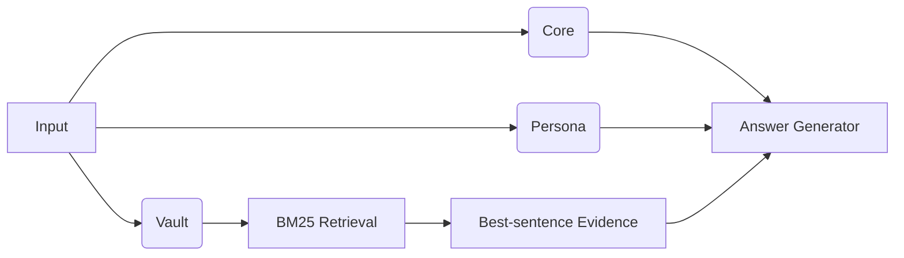

# 🐾 EverMate.AI — Your Local AI Companion
**Privacy-first · Works offline · Actually remembers you over long-term conversations**

> _"An AI can be a long‑term confidant — if it can **remember**, **protect**, and **retrieve**."_

<p align="center">
  <a href="#-why-evermateai">Why</a> ·
  <a href="#-signature-capabilities">Features</a> ·
  <a href="#-validation--benchmarks">Benchmarks</a> ·
  <a href="#-quick-start-the-shortest-path">Quick Start</a> ·
  <a href="#-how-it-works-mermaid-diagram">How it Works</a> ·
  <a href="#-tunables">Tunables</a> ·
  <a href="#-privacy--local-first-checklist">Privacy</a> ·
  <a href="#-faq-focused-on-the-signature-features">FAQ</a> ·
  <a href="#-roadmap">Roadmap</a> ·
  <a href="#-project-layout">Layout</a> ·
  <a href="#-contributing">Contributing</a>
</p>

---

## ✨ Why EverMate.AI?
Most online AIs suffer from two pain points:
1) **Short memory:** once the context window overflows, you start a new chat and lose your past self.
2) **Opaque privacy:** was your conversation uploaded, trained on, or analyzed? Hard to know.

**EverMate.AI** answers with **local storage & inference by default**, turning "long-term companion chat" into something **usable and controllable**. Three core ideas power the experience:

- **The Memory Ternary (_Core → Persona → Vault_)** — human‑like layered storage for speed **and** accuracy.
- **Scalable Local Index (_Large‑scale · Local · Fast_)** — chunk‑on‑disk + inverted index + BM25 retrieval with inline evidence snippets.
- **The Honesty Contract** — retrieval injects *evidence*, never expected answers; the model's reply is never silently replaced; benchmarks are deterministic and reproducible.

Result: high‑frequency topics are always at hand, and long‑tail memories are one query away — **entirely on your machine**.

> Even if you only reuse the ideas here, we hope this repo sparks better, safer long‑term AI companions for everyone.

---

## 🍱 Signature Capabilities
### 1) Memory Ternary (Core → Persona → Vault)
- **Core (high‑frequency memory):** topics you bring up often + assistant style cues, refreshed from your actual conversations (imported documents don't drown them out).
- **Persona (≤ 8 bullets):** communication preferences, info density, long‑term interests and no‑gos. Summarized by **your selected local LLM**; falls back to heuristics if none is available. Prior bullets are kept as context, so the persona evolves instead of resetting.
- **Vault (long‑tail memory):** everything else stored **as small disk chunks** and retrieved via **BM25**, with the **best original sentence** injected as fenced evidence.
- **Conflict rule:** when history disagrees with the current input, **prefer the current input**. Don't let stale memory derail you.

### 2) Scalable Local Index (Large‑scale · Local · Fast)
- **Chunk‑on‑disk:** ~**2.8K characters per chunk** (configurable). Measured: a 1.22M‑character novel indexes in **0.4s** (441 chunks); a 906K‑character Chinese novel in **3.0s** (326 chunks, 131K terms).
- **Inverted index:** SQLite with `terms/postings/chunks`, WAL, schema versioning, one transaction per imported document.
- **BM25 retrieval:** after a hit, **extract the best sentence** inside the chunk as an evidence snippet. CJK is tokenized as character bigrams (Han, kana, and hangul all covered).
- **Incremental by default:** chatting appends each turn to the index immediately; importing only indexes new content (**duplicates are skipped by content hash**). Full rebuild stays available and backs up the previous index first.

### 3) You can make it forget
A privacy-first companion needs a forget button. EverMate has three, right in the sidebar:
- **Forget chat memory** — erases chat history, chat-derived memory, *and* the persona distilled from it; imported documents stay.
- **Manage imported documents** — delete any imported file and rebuild memory without it.
- **Wipe all memory** — everything, including Core and Persona.

### 4) 10-second mental model
> **Hit with Core** for frequent patterns → **shape with Persona** → **prove with Vault evidence**. Short contexts, strong answers.

---

## 📊 Validation & Benchmarks
We do not treat EverMate.AI as a "trust me" memory demo. The benchmarks below are **deterministic, fully local, and reproducible** — and we publish the methodology along with the numbers.

> **⚠️ Honesty note (2026‑06).** Earlier published numbers (97.40% / 81.82% / 96.10%) were produced by an engine that hardcoded expected benchmark answers into its retrieval path — answer leakage. Those numbers are **withdrawn**; the offending engine is preserved unimported in `legacy_quanzhi_heuristics.py`. Everything below was measured on the rebuilt, corpus-agnostic engine.

### What we measure
- **Retrieval hit rate:** does BM25 surface the source passage for a blanked-out sentence? (No LLM involved.)
- **Cloze recall (end-to-end):** can the local model fill in the exact blanked term from the injected evidence?
- Question generation is **deterministic and corpus-derived** (seeded sampling; targets chosen by document-frequency bounds, plus PMI cohesion for Chinese). Scoring is **exact string containment** — no hand-written question bank, no LLM judge.

### Re-measured benchmark snapshots (2026-06-11)
> Public-domain corpora, reported by **character count**. One Chinese and one English corpus, tested separately.

| Corpus | Scale | Retrieval hit@6 (200 probes) | End-to-end (60 cloze) |
| --- | --- | --- | --- |
| 《紅樓夢》 Dream of the Red Chamber (zh) | 906K chars | **99.50%** | **93.33%** |
| Moby-Dick; Or, The Whale (en) | 1.22M chars | **100.00%** | **98.33%** |

### Latest run details
- Chinese: 906,088 chars → **326 chunks / 131,478 terms / 3.0s** to index; evidence snippet contained the answer in **100%** of 200 probes.
- English: 1,218,938 chars → **441 chunks / 17,115 terms / 0.4s** to index; evidence snippet contained the answer in **100%** of 200 probes.
- Answer model: `gpt-oss:20b` (temperature 0), fully local.
- Strict matching *understates* slightly: 3 of the 4 Chinese misses were near-hits (traditional/simplified script variants or partial names), and the single English miss was a model refusal, not a retrieval failure.

### Artifacts
- Benchmarks write structured JSON results and human-readable Markdown reports under `reports/`.
- Current benchmark script: `scripts/benchmark_public_corpus.py` (the older `scripts/validate_memory_*.py` scripts still run, but their question banks predate the rebuild).
- The two published reports are committed: `reports/hongloumeng-zh-report.md`, `reports/moby_dick-en-report.md`.

### Why these numbers matter
- Retrieval is near-perfect at the ~1M-character scale in **both languages** — BM25 over character bigrams is genuinely sufficient here.
- The end-to-end gap (93–98%) comes almost entirely from the **answering model**, not retrieval — a bigger local model should close it.
- That gives the project a concrete research direction instead of a vague promise.

---

## 🚀 Quick Start (the **shortest path**)

### Option A — Local (Python)
```bash
# 1) From the project root
pip install -r requirements.txt

# 2) Start
python app.py

# Optional: point to your local LLM
export OLLAMA_URL="http://localhost:11434"
export OLLAMA_MODEL="deepseek-r1:8b"
```

Then open the UI and either:
- **Import history:** drag‑drop `.docx/.txt` (or a folder of them) → click **Build/Rebuild Memory** → start chatting.
- **Start a new friend:** just chat; each Q&A turn is appended to the index. After N new chunks (default **20**), Core/Persona auto‑refresh **in the background** — the UI never freezes, and replies stream in token by token.

If no Ollama server is detected, the app shows step-by-step install instructions (install → start → pull a model) instead of a cryptic error.

### Option B — Run the tests
```bash
pip install -r requirements-dev.txt
python -m pytest tests/ -q     # 176 tests, no network, no Ollama needed
```

### Benchmark Example
```bash
# Fully local — no API keys, no cloud judge.
# Grab a public-domain corpus (Project Gutenberg #24264 or #2701), then:
python scripts/benchmark_public_corpus.py \
  --txt /path/to/hongloumeng.txt \
  --lang zh \
  --model gpt-oss:20b \
  --questions 60 \
  --retrieval-probes 200
```

Outputs will be written under `reports/` as:
- `*-results.json` (every case, probe, and reply)
- `*-report.md` (summary + the exact reproduction command)

---

## 🍎 macOS App & DMG
### Install (test build)
- Download the generated `EverMate-macOS-arm64.dmg`
- Open the DMG and drag `EverMate.app` into `Applications`
- The current test build is **ad-hoc signed** for bundle integrity, but it is **not Apple notarized**
- Because of that, the first launch may still be blocked by Gatekeeper

### First Launch On macOS
1. Open `Applications`
2. Find `EverMate.app`
3. Right-click the app and choose `Open`
4. When macOS shows the warning dialog, click `Open`
5. After that first approval, you can launch EverMate normally by double-clicking

If macOS still blocks the app:
1. Try the same `Right-click -> Open` path one more time
2. Or go to `System Settings -> Privacy & Security`
3. Scroll to the security section and click `Open Anyway` for EverMate
4. Re-open the app and confirm once

### Runtime expectations
- The packaged macOS app is built for **Apple Silicon**
- **Ollama is not bundled**; start your local Ollama server separately
- Writable data lives outside the app bundle — source runs and bundled builds share the same per-user location:
  - `~/Library/Application Support/EverMate/memory` (override with `MEMORY_DIR`)
- A second instance pointing at the same memory directory refuses to start instead of corrupting it

### Maintainer build
```bash
./scripts/build_macos_dmg.sh
```

Build outputs:
- `dist/EverMate.app`
- `dist/EverMate-macOS-arm64.dmg`
- `dist/EverMate-macOS-arm64-signing-report.txt`
- More maintainer notes (incl. the Developer ID / notarization path): `PACKAGING.md`

---

## 💼 How it Works (Mermaid diagram)

- **Chat vs recall:** ordinary turns skip retrieval to keep contexts short; memory-shaped questions ("还记得…", who/when/where/how many) trigger evidence retrieval.
- **Evidence injection:** retrieved sentences are injected **fenced** — instructions hidden inside imported text are never followed — for **verifiability**.
- **Responsive by design:** every model call and indexing job runs on a background worker; the UI thread never blocks.

Engine layout (`engine/` package):
- `textutil.py` — tokenization (EN words + CJK bigrams incl. kana/hangul), sentence splitting, query analysis
- `storage.py` — SQLite index, chunk store, ingestion, dedup, instance lock
- `retrieval.py` — BM25 + best-sentence evidence
- `persona.py` — Core/Persona refresh
- `manager.py` — the `MemoryManager` facade

---

## 🧲 Import vs. New (two paths, one engine)
- **Drag‑drop import:** `.docx` via python-docx; `.txt` via streaming read; folders are expanded automatically. Re-importing identical content is **skipped by content hash** instead of silently doubling the corpus.
- **New friend:** `append_turn` indexes every Q&A immediately; Core/Persona refresh every **20** new chunks by default, in the background.
- **Session auto-save:** GUI state is saved **atomically and debounced after every change** (not just on clean close) and restored on next launch — a crash no longer loses the session.

---

## 🔧 Tunables
- `CHUNK_CHARS` — default **2800**. Larger = fewer chunks; smaller = finer recall.
- `CORE_TOP_TERMS` — default **50** (top frequent terms shown in Core).
- `PERSONA_MAX_BULLETS` — default **8**.
- `REFRESH_EVERY` — default **20** (auto‑refresh for Core/Persona after N new chunks).
- `RETRIEVE_TOP_K` — default **6**.
- `EVERMATE_NUM_CTX` — default **8192** (Ollama context window; evidence-heavy prompts need the room).
- `EVERMATE_KEEP_ALIVE` — default **30m** (keeps the model warm between intermittent companion chats).

**Environment variables (examples)**
```bash
# Local LLM (optional)
export OLLAMA_URL="http://localhost:11434"
export OLLAMA_MODEL="deepseek-r1:8b"

# Memory root (default: ~/Library/Application Support/EverMate/memory)
export MEMORY_DIR="/path/to/memory"
```

---

## 🛡️ Privacy & Local‑first (Checklist)
- ✅ **Local storage & inference by default.** The app's only network traffic is to your local Ollama server.
- ✅ Index & memory live under your per-user data directory, on your disk only.
- ✅ **Forget controls in the UI:** clear chat memory / delete a document / wipe everything.
- ✅ Imported text is **fenced** in prompts; instructions hidden inside imported documents are not followed.
- ✅ Benchmarks run **without any cloud service or API key**.
- ⚠️ If you point `OLLAMA_URL` at a remote host, data leaves your machine — that's your call, not a default.
- 🔒 Suggested ops:
  - Disk encryption (FileVault) for the memory root
  - Split sensitive dialogs into separate `MEMORY_DIR` roots
  - Curate `01_core.md / 02_persona.md` + rebuild to prune stale entries
  - Prefer **offline runs** when feasible

---

## ❓ FAQ (focused on the signature features)
- **Persona didn't change yet?**
  Likely didn't hit the refresh threshold. Keep chatting, click **Analyze**, or lower `REFRESH_EVERY`.
- **Can I see the "original evidence"?**
  Yes — recall turns inject the most relevant original sentence, and the memory panel shows Core/Persona plus index stats.
- **The app says Ollama is not running.**
  Install from https://ollama.com/download (or `brew install ollama`), start it, pull a model (`ollama pull deepseek-r1:8b`), and send again.
- **No local LLM available?**
  Only Persona summarization is affected; heuristics kick in — indexing and retrieval keep working.
- **Stuck in old memory?**
  The system always **prefers the current input**; you can also delete specific documents or clear chat memory from the sidebar.
- **Index keeps growing?**
  Raise `CHUNK_CHARS`, delete documents you no longer need, or split friends into separate `MEMORY_DIR` roots.

---

## 🗺️ Roadmap
- Hybrid retrieval: **BM25 + local vectors** (bge/e5)
- Grounded short-QA and multi-hop benchmarks for the clean engine (cloze + retrieval are done)
- Topic bucketing & timeline views for the Vault
- Explainability panel: show which Core/Persona/Vault items fired this round
- Memory decay & richer conflict resolution
- Developer ID signing + notarization for the macOS build

---

## 📦 Project Layout
```
app.py                  # entry point
engine/                 # the memory engine (see How it Works)
views/                  # Qt UI (chat page, main window)
assets/                 # stylesheets (light/dark) and icons
ollama_client.py        # local LLM client: streaming, errors, think-filtering
models_config.py        # recommended model resolution
runtime_paths.py        # per-user data dir, resource paths
i18n_qt.py              # zh/en strings
memory_manager.py       # compatibility shim → engine/
legacy_quanzhi_heuristics.py  # retired overfitted engine (reference only)
scripts/                # benchmark scripts, DMG build
tests/                  # pytest suite (176 tests; no network, no Ollama)

<memory root>/          # ~/Library/Application Support/EverMate/memory
  index.sqlite          # inverted index & stats
  chunks/               # text chunks on disk
  uploads/              # copies of imported files
  buffer.txt            # incremental buffer
  chat_log.txt          # raw chat log (rebuild source)
  app_state.json        # GUI session state
  01_core.md            # Core memory (high-frequency, style cues)
  02_persona.md         # Persona (≤ 8 bullets)
  03_vault.md           # Long-tail summary log
```

---

## 🤝 Contributing
We welcome Issues/PRs for:
- Improvements to the **Memory Ternary**
- Adapters & parameter recipes for different local LLMs
- Retrieval/ranking/fusion experiments and best practices

Please also see `CONTRIBUTING.md` and `SECURITY.md` — and note the house rule: **no corpus-specific heuristics in the engine, ever again.**

---

## 📜 License
MIT (see `LICENSE` in the repo).

---

## 🌱 Inspiration
Even if this project never ships a full product, the ideas are free to reuse. If anything here helps you build better privacy‑first companions, that's a win already. If you do ship something, consider sending a PR or a note — we'd love to learn from your journey.
