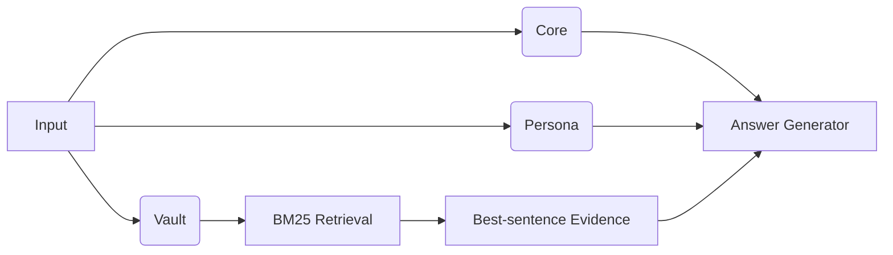

# 🐾 EverMate.AI — Your Local AI Companion
**Privacy-first · Works offline · Actually remembers you over long-term conversations**

> _“An AI can be a long‑term confidant — if it can **remember**, **protect**, and **retrieve**.”_

<p align="center">
  <a href="#-why-evermateai">Why</a> ·
  <a href="#-signature-capabilities">Features</a> ·
  <a href="#-validation--benchmarks">Benchmarks</a> ·
  <a href="#-quick-start-the-shortest-path">Quick Start</a> ·
  <a href="#-how-it-works">How it Works</a> ·
  <a href="#-tunables">Tunables</a> ·
  <a href="#-privacy--local-first-checklist">Privacy</a> ·
  <a href="#-faq">FAQ</a> ·
  <a href="#-roadmap">Roadmap</a> ·
  <a href="#-project-layout">Layout</a> ·
  <a href="#-contributing">Contributing</a>
</p>

---

## ✨ Why EverMate.AI?
Most online AIs suffer from two pain points:  
1) **Short memory:** once the context window overflows, you start a new chat and lose your past self.  
2) **Opaque privacy:** was your conversation uploaded, trained on, or analyzed? Hard to know.

**EverMate.AI** answers with **local storage & inference by default**, turning “long-term companion chat” into something **usable and controllable**. Two core ideas power the experience:

- **The Memory Ternary (_Core → Persona → Vault_)** — human‑like layered storage for speed **and** accuracy.  
- **Scalable Local Index (_Large‑scale · Local · Fast_)** — chunk‑on‑disk + inverted index + BM25 retrieval with inline evidence snippets.

Result: high‑frequency topics are always at hand, and long‑tail memories are one query away — **entirely on your machine**.

> Even if you only reuse the ideas here, we hope this repo sparks better, safer long‑term AI companions for everyone.

---

## 🍱 Signature Capabilities
### 1) Memory Ternary (Core → Persona → Vault)
- **Core (high‑frequency memory):** topics you bring up often + assistant style cues (e.g., address the user respectfully, include examples, keep a gentle tone). Most queries hit Core directly — **fast and stable**.
- **Persona (≤ 8 bullets):** communication preferences, info density, long‑term interests and no‑gos. Prefer **local LLM** summarization; fall back to heuristics if not available.
- **Vault (long‑tail memory):** everything else stored **as small disk chunks** and retrieved via **BM25**, with the **best original sentence** injected as evidence.
- **Conflict rule:** when history disagrees with the current input, **prefer the current input**. Don’t let stale memory derail you.

### 2) Scalable Local Index (Large‑scale · Local · Fast)
- **Chunk‑on‑disk:** ~**2.8K characters per chunk** (configurable), scales from 100K to multi‑million characters.
- **Inverted index:** SQLite with `terms/postings/chunks`, WAL‑safe read/write.
- **BM25 retrieval:** after hit, **extract the best sentence** inside the chunk as an evidence snippet.
- **Streaming build & incremental refresh:** drag‑drop `.docx/.txt` to ingest while indexing; chatting appends turns to disk; refresh Core/Persona after a threshold.

### 3) 10-second mental model
> **Hit with Core** for frequent patterns → **shape with Persona** → **prove with Vault evidence**. Short contexts, strong answers.

---

## 📊 Validation & Benchmarks
We do not treat EverMate.AI as a "trust me" memory demo. The project includes reproducible local benchmarks that measure factual recall, short-answer grounding, and multi-hop consistency on long-form corpora.

### What we measure
- **Cloze recall:** can the system retrieve and complete an exact fact from long context?
- **Grounded short QA:** can it answer short factual questions without drifting?
- **Multi-hop consistency:** can it combine evidence across chunks without mixing nearby events?

### Recent benchmark snapshots
> To avoid overstating the results, the numbers below are reported by **character count** rather than vague "book length" claims.

| Corpus Scale | Benchmark Shape | Result |
| --- | --- | --- |
| ~36万 characters | 77-question cloze recall | **97.40%** |
| ~86万 characters | 77-question hard-mode mixed recall | **81.82%** |
| ~536万 characters | 77-question novel accuracy benchmark | **76.62%** overall |

### Latest large-novel run
- Corpus size: **5,367,383 characters**
- Paragraphs: **106,993**
- Indexed chunks: **1,927**
- Indexed terms: **311,133**
- Answer model: `hf.co/TrevorJS/gemma-4-26B-A4B-it-uncensored-GGUF:Q8_0`
- Overall accuracy: **76.62%**
- By type:
  - `cloze`: **83.65%**
  - `grounded_short_qa`: **70.00%**
  - `multi_hop_consistency`: **50.00%**

### Artifacts
- Benchmarks write:
  - question banks
  - structured JSON results
  - human-readable Markdown or text reports
- Current benchmark scripts:
  - `scripts/validate_memory_cloze.py`
  - `scripts/validate_memory_hardmode.py`
  - `scripts/validate_memory_accuracy.py`
- Generated reports live under `reports/`.

### Why these numbers matter
- The system is already strong at **single-fact recall** on very large corpora.
- The current main bottleneck is **cross-chunk retrieval and multi-hop consistency**.
- That gives the project a concrete research direction instead of a vague promise.

---

## 🚀 Quick Start (the **shortest path**)
> These are reference commands for your README homepage. Adjust to your packaging later (Python/Docker/etc.).

### Option A — Local (Python)
```bash
# 1) From the project root
pip install -r requirements.txt

# 2) Start
python app.py

# Optional: point to your local LLM for Persona summarization
export OLLAMA_URL="http://localhost:11434"
export OLLAMA_MODEL="qwen2.5:7b-instruct"
```

Then open the UI and either:
- **Import history:** drag‑drop `.docx/.txt` → click **Build/Rebuild Memory** → start chatting.  
- **Start a new friend:** just chat; each Q&A turn is appended to the index. After N new chunks (default **20**), Core/Persona auto‑refresh.

### Option B — Docker (placeholder)
```bash
# Example placeholder; replace <you> with your org/repo later
docker run --rm -it -p 7860:7860   -e OLLAMA_URL="http://host.docker.internal:11434"   -v $PWD/memory:/app/memory   ghcr.io/<you>/evermate:latest
```

### Benchmark Example
```bash
# 77-question large-corpus accuracy run
export GOOGLE_API_KEY="your_key_here"

python scripts/validate_memory_accuracy.py \
  --docx /path/to/novel.docx \
  --questions 77 \
  --cloze-questions 52 \
  --short-qa-questions 15 \
  --multi-hop-questions 10 \
  --judge-provider google \
  --judge-model gemini-3.1-pro-preview
```

Outputs will be written under `reports/` as:
- `*-accuracy-question-bank.json`
- `*-accuracy-question-bank.md`
- `*-accuracy-results.json`
- `*-accuracy-report.md`

---

## 🍎 macOS App & DMG
### Install (test build)
- Download the generated `EverMate-macOS-arm64.dmg`
- Open the DMG and drag `EverMate.app` into `Applications`
- The current test build is **ad-hoc signed** for bundle integrity, but it is **not Apple notarized**
- Because of that, the first launch may still be blocked by Gatekeeper

### First Launch On macOS
1. Open `Applications`
2. Find `EverMate.app`
3. Right-click the app and choose `Open`
4. When macOS shows the warning dialog, click `Open`
5. After that first approval, you can launch EverMate normally by double-clicking

If macOS still blocks the app:
1. Try the same `Right-click -> Open` path one more time
2. Or go to `System Settings -> Privacy & Security`
3. Scroll to the security section and click `Open Anyway` for EverMate
4. Re-open the app and confirm once

### Runtime expectations
- The packaged macOS app is built for **Apple Silicon**
- **Ollama is not bundled**; start your local Ollama server separately if you want local model-backed chat and memory analysis
- Bundled builds store writable data outside the app bundle under:
  - `~/Library/Application Support/EverMate/memory`

### Maintainer build
```bash
./scripts/build_macos_dmg.sh
```

Build outputs:
- `dist/EverMate.app`
- `dist/EverMate-macOS-arm64.dmg`
- `dist/EverMate-macOS-arm64-signing-report.txt`
- More maintainer notes: `PACKAGING.md`

---

## 💼 How it Works (Mermaid diagram)

- **Short‑circuit first:** if Core/Persona can answer, don’t bloat the context.
- **Evidence injection:** when “recall” is needed, inject the best original sentence for **verifiability**.

---

## 🧲 Import vs. New (two paths, one engine)
- **Drag‑drop import:** `.docx` via stdlib parser; `.txt` via streaming read. After full indexing, answers are backed by the Memory Ternary.  
- **New friend:** `append_turn` adds every Q&A; Core/Persona refresh every **20** new chunks by default.
- **Session auto-save:** when closing the app, GUI state is saved automatically and restored on next launch.

---

## 🔧 Tunables
- `CHUNK_CHARS` — default **2800**. Larger = fewer chunks; smaller = finer recall.
- `CORE_TOP_TERMS` — default **50** (top frequent terms shown in Core).
- `PERSONA_MAX_BULLETS` — default **8**.
- `REFRESH_EVERY` — default **20** (auto‑refresh for Core/Persona after N new chunks).
- Retrieval **Top‑K** — `retrieve(query, k)`, recommended **4–8**.

**Environment variables (examples)**
```bash
# Local LLM (optional)
export OLLAMA_URL="http://localhost:11434"
export OLLAMA_MODEL="qwen2.5:7b-instruct"

# Memory root (default: ./memory in source runs; bundled macOS builds use ~/Library/Application Support/EverMate/memory)
export MEMORY_DIR="./memory"
```

---

## 🛡️ Privacy & Local‑first (Checklist)
- ✅ **Local storage & inference by default** (can pair with a local LLM).  
- ✅ Index & memory live under `memory/`; consider encryption & periodic backups.  
- ⚠️ If you switch to remote models, **assess network and compliance**.  
- 🔒 Suggested ops:
  - Disk encryption for `memory/`
  - Split sensitive dialogs into separate `memory` roots
  - Curate `01_core.md / 02_persona.md` + rebuild to prune stale entries
  - Prefer **offline runs** when feasible

---

## ❓ FAQ (focused on the signature features)
- **Persona didn’t change yet?**  
  Likely didn’t hit the refresh threshold. Keep chatting, rebuild manually, or lower `REFRESH_EVERY`.
- **Can I see the “original evidence”?**  
  Yes — long‑tail retrieval injects the most relevant original sentence/fragment.
- **Index keeps growing?**  
  Raise `CHUNK_CHARS`, archive old chunks periodically, or split friends into separate `memory` roots.
- **No local LLM available?**  
  Only Persona summarization is affected; heuristics kick in — the pipeline keeps working.
- **Stuck in old memory?**  
  The system always **prefers the current input**; also curate `01_core.md / 02_persona.md` and rebuild.

---

## 🗺️ Roadmap
- Hybrid retrieval: **BM25 + local vectors** (bge/e5)  
- Topic bucketing & timeline views for the Vault  
- Explainability panel: show which Core/Persona/Vault items fired this round  
- Memory decay & conflict resolution with explicit “prefer current input”  
- Event extraction: card‑style facts for structured recall & reviews

---

## 📦 Project Layout
```
memory/
  index.sqlite    # inverted index & stats
  chunks/         # text chunks on disk
  uploads/        # copies of imported files
  buffer.txt      # incremental buffer
  01_core.md      # Core memory (high-frequency, style cues)
  02_persona.md   # Persona (≤ 8 bullets)
  03_vault.md     # Long-tail notes (dynamically retrieved)
```

---

## 🤝 Contributing
We welcome Issues/PRs for:
- Improvements to the **Memory Ternary**
- Adapters & parameter recipes for different local LLMs
- Retrieval/ranking/fusion experiments and best practices

Please also see `CONTRIBUTING.md`, `CODE_OF_CONDUCT.md`, and `SECURITY.md` (add these when ready).

---

## 📜 License
MIT (see `LICENSE` in the repo).

---

## 🌱 Inspiration
Even if this project never ships a full product, the ideas are free to reuse. If anything here helps you build better privacy‑first companions, that’s a win already. If you do ship something, consider sending a PR or a note — we’d love to learn from your journey.
