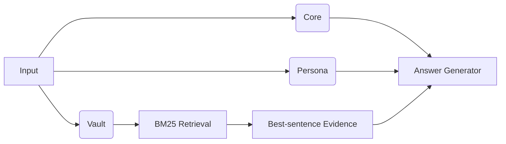

# 🐾 EverMate.AI — Your Local AI Companion
**Privacy-first · Works offline · Actually remembers you over long-term conversations**

> _"An AI can be a long‑term confidant — if it can **remember**, **protect**, and **retrieve**."_

<p align="center">
  <a href="#-why-evermateai">Why</a> ·
  <a href="#-signature-capabilities">Features</a> ·
  <a href="#-validation--benchmarks">Benchmarks</a> ·
  <a href="#-quick-start-the-shortest-path">Quick Start</a> ·
  <a href="#-how-it-works">How it Works</a> ·
  <a href="#-tunables">Tunables</a> ·
  <a href="#-privacy--local-first-checklist">Privacy</a> ·
  <a href="#-faq">FAQ</a> ·
  <a href="#-roadmap">Roadmap</a> ·
  <a href="#-project-layout">Layout</a> ·
  <a href="#-contributing">Contributing</a>
</p>

---

## ✨ Why EverMate.AI?
Most online AIs suffer from two pain points:
1) **Short memory:** once the context window overflows, you start a new chat and lose your past self.
2) **Opaque privacy:** was your conversation uploaded, trained on, or analyzed? Hard to know.

**EverMate.AI** answers with **local storage & inference by default**, turning "long-term companion chat" into something **usable and controllable**. Two core ideas power the experience:

- **The Memory Ternary (_Core → Persona → Vault_)** — human‑like layered storage for speed **and** accuracy.
- **Scalable Local Index (_Large‑scale · Local · Fast_)** — chunk‑on‑disk + inverted index + BM25 retrieval with inline evidence snippets.

Result: high‑frequency topics are always at hand, and long‑tail memories are one query away — **entirely on your machine**.

---

## 🍱 Signature Capabilities
### 1) Memory Ternary (Core → Persona → Vault)
- **Core (high‑frequency memory):** topics you bring up often + assistant style cues. Refreshed periodically from your actual conversations.
- **Persona (≤ 8 bullets):** communication preferences, info density, long‑term interests and no‑gos. Summarized by your **local LLM** (using the model you selected); falls back to heuristics if no LLM is available. Prior bullets are kept as context, so the persona evolves instead of resetting.
- **Vault (long‑tail memory):** everything else stored **as small disk chunks** and retrieved via **BM25**, with the **best original sentence** injected as fenced evidence.
- **Conflict rule:** when history disagrees with the current input, **prefer the current input**.
- **The honesty contract:** retrieval injects *evidence*, never expected answers; the model's reply is never silently replaced by synthesized text; extractive fallbacks fire only when the model produced nothing at all.

### 2) Scalable Local Index (Large‑scale · Local · Fast)
- **Chunk‑on‑disk:** ~**2.8K characters per chunk** (configurable).
- **Inverted index:** SQLite with `terms/postings/chunks`, WAL, schema versioning, single transaction per imported document.
- **BM25 retrieval:** after a hit, the **best sentence** inside the chunk is extracted as an evidence snippet.
- **Incremental by default:** chatting appends turns to the index immediately; importing a document indexes only the new content (duplicates are detected by content hash). Full rebuild stays available as an explicit action and backs up the previous index first.

### 3) You can make it forget
A privacy-first companion needs a forget button. EverMate has three:
- **Forget chat memory** — erases chat history and chat-derived memory, keeps imported documents.
- **Manage imported documents** — delete any imported file and rebuild memory without it.
- **Wipe all memory** — everything, including Core and Persona.

### 4) 10-second mental model
> **Hit with Core** for frequent patterns → **shape with Persona** → **prove with Vault evidence**. Short contexts, strong answers.

---

## 📊 Validation & Benchmarks

> **⚠️ 2026-06 honesty note.** Benchmark numbers previously published here
> (97.40% / 81.82% / 76.62% on a 5.3M-character novel corpus) were produced
> by an engine that **hardcoded expected benchmark answers** into query
> expansion, candidate scoring, and answer repair. That is answer leakage:
> the numbers measured the test set, not general retrieval quality, and they
> have been **withdrawn**. The overfitted engine is preserved for reference
> in `legacy_quanzhi_heuristics.py` and is no longer used by the app.

The current engine is corpus-agnostic by construction (no entity lists, no
per-question heuristics). The benchmark scripts under `scripts/` still run
against it; fresh numbers on a public-domain corpus will be published once
re-measured. Until then, this section intentionally makes no quantitative
claims.

### What the benchmarks measure
- **Cloze recall:** can the system retrieve and complete an exact fact from long context?
- **Grounded short QA:** can it answer short factual questions without drifting?
- **Multi-hop consistency:** can it combine evidence across chunks without mixing nearby events?

### Privacy note for benchmark runs
`scripts/validate_memory_accuracy.py` supports a **cloud judge** (e.g.
Google Gemini via `GOOGLE_API_KEY`). When you use it, **corpus excerpts and
model answers are sent to that cloud service** — never run it on private
data. Local-judge runs keep everything on your machine.

---

## 🚀 Quick Start (the **shortest path**)
```bash
# 1) From the project root
pip install -r requirements.txt

# 2) Start
python app.py

# Optional: point to your local LLM
export OLLAMA_URL="http://localhost:11434"
export OLLAMA_MODEL="deepseek-r1:8b"
```

Then open the UI and either:
- **Import history:** drag‑drop `.docx/.txt` → click **Build/Rebuild Memory** → start chatting.
- **Start a new friend:** just chat; each Q&A turn is appended to the index. After N new chunks (default **20**), Core/Persona refresh automatically in the background.

If no Ollama server is detected, the app shows step-by-step install
instructions (install → start → pull a model) instead of a cryptic error.

### Run the tests
```bash
pip install -r requirements-dev.txt
python -m pytest tests/ -q
```

---

## 🍎 macOS App & DMG
### Install (test build)
- Download the generated `EverMate-macOS-arm64.dmg`
- Open the DMG and drag `EverMate.app` into `Applications`
- The current test build is **ad-hoc signed** for bundle integrity, but it is **not Apple notarized**
- Because of that, the first launch may still be blocked by Gatekeeper

### First Launch On macOS
1. Open `Applications`
2. Find `EverMate.app`
3. Right-click the app and choose `Open`
4. When macOS shows the warning dialog, click `Open`
5. After that first approval, you can launch EverMate normally by double-clicking

If macOS still blocks the app:
1. Try the same `Right-click -> Open` path one more time
2. Or go to `System Settings -> Privacy & Security`
3. Scroll to the security section and click `Open Anyway` for EverMate
4. Re-open the app and confirm once

### Runtime expectations
- The packaged macOS app is built for **Apple Silicon**
- **Ollama is not bundled**; start your local Ollama server separately
- Writable data lives outside the app bundle under:
  - `~/Library/Application Support/EverMate/memory`
  - (source runs use the same per-user location; set `MEMORY_DIR` to override)

### Maintainer build
```bash
./scripts/build_macos_dmg.sh
```

Build outputs:
- `dist/EverMate.app`
- `dist/EverMate-macOS-arm64.dmg`
- `dist/EverMate-macOS-arm64-signing-report.txt`
- More maintainer notes: `PACKAGING.md`

---

## 💼 How it Works

- **Chat vs recall:** ordinary turns skip retrieval to keep contexts short; memory-shaped questions ("还记得…", who/when/where/how many) trigger evidence retrieval.
- **Evidence injection:** retrieved sentences are injected **fenced** (instructions inside imported text are never followed) for **verifiability**.
- **Responsive by design:** all model calls and indexing run on a background worker; replies stream in token by token.

Engine layout (`engine/` package):
- `textutil.py` — tokenization (EN words + CJK bigrams incl. kana/hangul), sentence splitting, query analysis
- `storage.py` — SQLite index, chunk store, ingestion, dedup, instance lock
- `retrieval.py` — BM25 + best-sentence evidence
- `persona.py` — Core/Persona refresh
- `manager.py` — the `MemoryManager` facade

---

## 🔧 Tunables
- `CHUNK_CHARS` — default **2800**. Larger = fewer chunks; smaller = finer recall.
- `CORE_TOP_TERMS` — default **50** (top frequent terms shown in Core).
- `PERSONA_MAX_BULLETS` — default **8**.
- `REFRESH_EVERY` — default **20** (auto‑refresh for Core/Persona after N new chunks).
- `RETRIEVE_TOP_K` — default **6**.
- `EVERMATE_NUM_CTX` — default **8192** (Ollama context window; evidence-heavy prompts need room).
- `EVERMATE_KEEP_ALIVE` — default **30m** (keeps the model warm between intermittent chats).

**Environment variables (examples)**
```bash
# Local LLM (optional)
export OLLAMA_URL="http://localhost:11434"
export OLLAMA_MODEL="deepseek-r1:8b"

# Memory root (default: ~/Library/Application Support/EverMate/memory on macOS)
export MEMORY_DIR="/path/to/memory"
```

---

## 🛡️ Privacy & Local‑first (Checklist)
- ✅ **Local storage & inference by default.** The app's only network traffic is to your local Ollama server.
- ✅ Index & memory live under your per-user data directory; chat logs are plain text **on your disk only**.
- ✅ **Forget controls** in the UI: clear chat memory / delete a document / wipe everything.
- ✅ Imported text is fenced in prompts; instructions hidden inside imported documents are not followed.
- ⚠️ If you switch `OLLAMA_URL` to a remote host or use the **cloud judge** in benchmark scripts, data leaves your machine — that's your call, not a default.
- 🔒 Suggested ops: disk encryption (FileVault), separate `MEMORY_DIR` roots for sensitive topics, periodic backups.

---

## ❓ FAQ
- **Persona didn't change yet?**
  Likely didn't hit the refresh threshold. Keep chatting, click **Analyze**, or lower `REFRESH_EVERY`.
- **Can I see the "original evidence"?**
  Yes — recall turns inject the most relevant original sentence, and the memory panel shows Core/Persona plus index stats.
- **The app says Ollama is not running.**
  Install from https://ollama.com/download (or `brew install ollama`), start it, pull a model (`ollama pull deepseek-r1:8b`), and send again.
- **No local LLM available?**
  Only Persona summarization is affected; heuristics kick in — the indexing/retrieval pipeline keeps working.
- **Stuck in old memory?**
  The system always **prefers the current input**; you can also delete specific documents or clear chat memory from the sidebar.

---

## 🗺️ Roadmap
- Re-measured benchmarks on a public-domain corpus (honest numbers for the clean engine)
- Hybrid retrieval: **BM25 + local vectors** (bge/e5)
- Topic bucketing & timeline views for the Vault
- Explainability panel: show which Core/Persona/Vault items fired this round
- Memory decay & richer conflict resolution
- Developer ID signing + notarization for the macOS build

---

## 📦 Project Layout
```
app.py                  # entry point
engine/                 # the memory engine (see How it Works)
views/                  # Qt UI (chat page, main window)
ollama_client.py        # local LLM client: streaming, errors, think-filtering
models_config.py        # recommended model resolution
runtime_paths.py        # per-user data dir, resource paths
i18n_qt.py              # zh/en strings
memory_manager.py       # compatibility shim → engine/
legacy_quanzhi_heuristics.py  # retired overfitted engine (reference only)
scripts/                # benchmark & validation scripts, DMG build
tests/                  # pytest suite (no network, no Ollama needed)

<memory root>/          # ~/Library/Application Support/EverMate/memory
  index.sqlite          # inverted index & stats
  chunks/               # text chunks on disk
  uploads/              # copies of imported files
  buffer.txt            # incremental buffer
  chat_log.txt          # raw chat log (rebuild source)
  app_state.json        # GUI session state
  01_core.md            # Core memory
  02_persona.md         # Persona bullets
  03_vault.md           # Vault summary log
```

---

## 🤝 Contributing
We welcome Issues/PRs for:
- Improvements to the **Memory Ternary**
- Adapters & parameter recipes for different local LLMs
- Retrieval/ranking/fusion experiments and best practices

See `CONTRIBUTING.md` and `SECURITY.md`.

---

## 📜 License
MIT — see [LICENSE](LICENSE).

---

## 🌱 Inspiration
Even if this project never ships a full product, the ideas are free to reuse. If anything here helps you build better privacy‑first companions, that's a win already.
